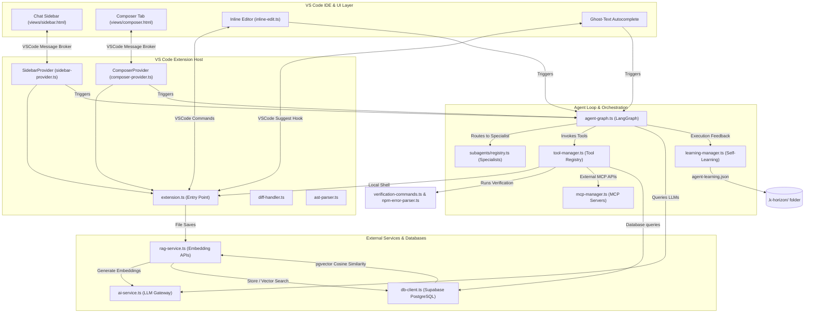

# K-Horizon System Architecture and Developer Guide

This document describes the internals, data flow, and APIs of the K-Horizon VS Code extension. It is designed to help open-source contributors understand, maintain, and extend the project.

---

## 1. System Overview

K-Horizon separates the VS Code UI (Webviews) from the background Extension Host (NodeJS) and the AI Agent loops (LangGraph).



---

## 2. Core Components and Module Breakdown

### 2.1 Extension Bootstrapping (`src/extension.ts`)
The `activate` function is called when the extension starts. Its responsibilities include:
1.  **Instruction Loading**: Reads repository-level configuration files and caches them in the global state.
2.  **Database Connection**: Runs PostgreSQL migrations on Supabase if a connection string is set via `SecretStorage`.
3.  **File Synchronization**: Watches for file saves and deletions, invoking `RAGService` to keep database vectors in sync.
4.  **UI Registry**: Registers the `SidebarProvider` webview, the `ComposerProvider` webview, the `AutocompleteProvider` (for ghost-text), and the commands for inline editing.

### 2.2 UI-to-Host Communication (`src/webview-handlers/`)
All communications between VS Code Webviews and the Extension Host occur through structured JSON messages sent via the message broker (`message-broker.ts`).
*   **Webview -> Host**: Handlers are grouped by functionality:
    *   `chat-handlers.ts`: Manages sidebar query messages and routes them to the agent graph.
    *   `diff-handlers.ts`: Applies or discards file hunks inside the Workspace Composer.
    *   `mcp-handlers.ts`: Manages starting, restarting, or configuring Model Context Protocol tool servers.
    *   `learning-handlers.ts`: Displays agent rules or mistakes.
*   **Host -> Webview**: Uses the message broker to post token chunks (for text streaming), command execution results, and diff trees.

### 2.3 The Agent Graph Loop (`src/agent-graph.ts`)
The agent orchestration loop is built using LangChain's **LangGraph** framework. 
*   **State Schema (`AgentState`)**: Defines the channel parameters that persist throughout the agent loop:
    *   `chatHistory`: Accumulates messages, tool inputs, and tool outputs.
    *   `compileHealAttempts` / `testHealAttempts`: Track iteration budgets for self-healing loops.
    *   `onToken`: Direct stream callback used to pass LLM output tokens to the Webview UI.
*   **Agent Logic**: The loop transitions from `START -> subagent classification -> LLM call -> tool node execution -> verification check -> self-healing (if compile/test errors) -> END`.

### 2.4 Subagent Registry (`src/subagents/registry.ts`)
Requests are routed to specialized subagents depending on keyword scoring or LLM classification:
1.  `frontend-designer`: Handles React, CSS, HTML, and styling prompts.
2.  `backend-architect`: Coordinates API, PostgreSQL database schemas, and server-side logic.
3.  `mobile-builder`: Handles React Native and mobile configuration setups.
4.  `security-reviewer`: Focuses on auditing vulnerabilities and dependency scanning.
5.  `test-writer`: Focuses on generating unit tests (Vitest) and E2E tests (Playwright).
6.  `general-builder`: Fallback agent profile for general full-stack programming.

### 2.5 Tool Management (`src/tool-manager.ts`)
Defines the individual system-level capabilities exposed to the agents:
*   **File Actions**: Read, write, and patch files using line indices to prevent rewriting large code files.
*   **Shell Invocation**: Runs scripts locally or within an isolated Docker container based on the `sandboxMode` setting.
*   **Validation**: Integrates compilation dry-runs to ensure edits don't break TypeScript or Webpack builds.

### 2.6 Supabase DB Client & RAG (`src/db-client.ts` & `src/rag-service.ts`)
*   **Database Management**: Connects to the Supabase PostgreSQL database using connection pools (`pg` library). Runs database migrations stored inside the `views` or inline.
*   **RAG pipeline**:
    1.  On file save, `ast-parser.ts` extracts the code outline.
    2.  `rag-service.ts` splits the source file into semantic chunks.
    3.  Generates vector embeddings for the chunks using the configured provider.
    4.  Stores the embeddings in the database table.
    5.  On query execution, embeds the prompt, queries the database using `pgvector` cosine similarity, and injects the top matching chunks into the prompt context.

### 2.7 Model Context Protocol (`src/mcp-manager.ts`)
*   Spawns subprocesses dynamically based on configured node commands/arguments.
*   Manages the JSON-RPC communication protocol to list tools, resources, and execute actions on external servers.
*   Maintains connection state and dynamically updates `ToolManager` with remote capabilities.

---

## 3. Customizing and Extending the Codebase

### 3.1 Adding a New Tool
To create a new tool that the agent can call:
1.  Open `src/tool-manager.ts`.
2.  Add your tool to the `requiredToolArgs` registry, specifying its parameter schema:
    ```typescript
    private static readonly requiredToolArgs = {
      // ...
      my_new_tool: ['argument_one'],
    };
    ```
3.  Add the tool's OpenAI/Anthropic schema specification to `toolSpecs`:
    ```typescript
    private static readonly toolSpecs = {
      my_new_tool: {
        description: 'Describe what the tool does here.',
        required: ['argument_one'],
        properties: {
          argument_one: { type: 'string', description: 'Describe the argument.' },
        },
      },
    };
    ```
4.  Implement the execution handler within `executeTool`:
    ```typescript
    case 'my_new_tool':
      return await this.handleMyNewTool(args.argument_one);
    ```

### 3.2 Creating a Custom Subagent Profile
To register a new specialist:
1.  Open `src/subagents/registry.ts`.
2.  Add a new entry to the `SUBAGENTS` array:
    ```typescript
    {
      id: 'data-scientist',
      label: 'Data Scientist',
      description: 'Python, data processing, and analysis tasks.',
      systemPrompt: 'You are a data science expert. Focus on data modeling...',
      toolAllowList: ALL_TOOLS,
      triggers: ['python', 'pandas', 'numpy', 'data', 'analytics'],
      pinnedSkillIds: [],
    }
    ```
3.  Add the ID to the `SubagentId` type union at the top of the file.
