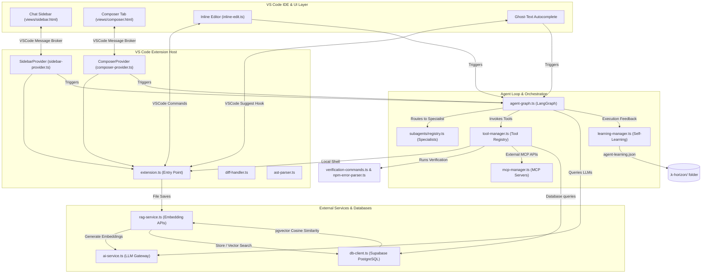

# K-Horizon System Architecture

This document describes the design and module layout of the K-Horizon VS Code extension.

## System Design

K-Horizon separates the VS Code UI layer from the background extension host and the agent orchestration engine.

## Module Responsibilities

The extension is organized into the following components:

### Core Extension Host
*   `src/extension.ts`: Entry point. Registers VS Code commands, registers webview providers, mounts file system event watchers, and initializes database connection and codebase indexing.
*   `src/diff-handler.ts`: Calculates differences and applies edits cleanly to local workspace files.
*   `src/ast-parser.ts`: Uses the TypeScript compiler API to parse source code files, generating file outline tokens (imports, class/function positions).
*   `src/context-manager.ts`: Coordinates codebase index parsing. Summarizes file structures, imports, and AST context.

### User Interface Providers
*   `src/inline-edit.ts`: Manages the inline edit interface inside text editors, streaming completions, and handling accept/reject shortcuts.
*   `src/composer-provider.ts`: Manages the Workspace Composer tab for multi-file workspace edits.
*   `src/sidebar-provider.ts`: Manages the Chat Sidebar webview, handling `@` file references, file uploads, and conversation history.
*   `src/autocomplete-provider.ts`: Implements the inline completion item provider to display non-intrusive ghost text suggestions.
*   `views/`: Contains frontend HTML, CSS (`shared.css`), and JavaScript for the webviews (`sidebar.js`, `composer.js`).

### Agent Core
*   `src/agent-graph.ts`: Implements the LangChain/LangGraph agent state loop. Coordinates tool outputs, system instructions, self-healing compilation, and retry logic.
*   `src/subagents/registry.ts`: Registers specialized developer profiles (Frontend Designer, Backend Architect, Mobile Builder, Security Reviewer, Test Writer, General Builder) and classifies incoming requests.
*   `src/tool-manager.ts`: The registry for tools that the agent is allowed to invoke (e.g. read file, write file, execute command, query database).
*   `src/mcp-manager.ts`: Manages external Model Context Protocol (MCP) server processes or HTTP/SSE connections.
*   `src/learning-manager.ts`: Manages workspace-local learning. Reviews execution traces and logs rules in `.k-horizon/agent-learning.json`.

### Services
*   `src/ai-service.ts`: Gateway for LLM requests. Connects to configured cloud APIs, local LLM runners, or custom OpenAI-compatible endpoints.
*   `src/db-client.ts`: Manages connection pools and database schemas on Supabase.
*   `src/rag-service.ts`: Computes vector embeddings and runs cosine-similarity searches inside the Supabase database.
*   `src/verification-commands.ts`: Executes project build or test suites during healing loops.
*   `src/npm-error-parser.ts`: Parses Webpack, TypeScript compile, or Vitest errors and produces clean diagnostic summaries.
