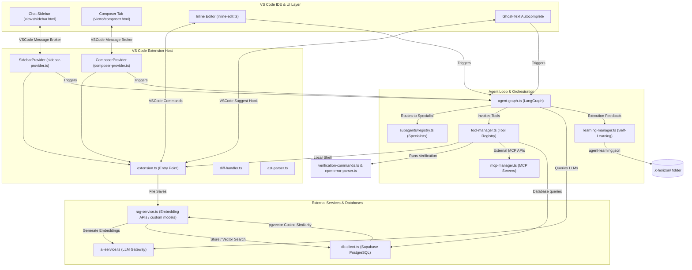

# K-HORIZON 🚀

> A token-efficient, customizable, agentic AI coding assistant for VS Code.

**K-HORIZON** is a high-performance VS Code extension designed to bring powerful agentic capabilities and developer tools directly into your editor. Built on LangChain's **LangGraph**, it coordinates specialized agent profiles to perform multi-file modifications, inline code edits, conversational sidebar chat, and ghost-text autocompletion. The extension supports bringing your own custom models, whether hosted on cloud APIs or run locally.

---

## 🌟 Key Features

*   **⚡ Inline Code Edits (`Ctrl+Shift+K`)** — Highlight a selection, enter your instructions, and watch changes stream in real-time with clear diff decoration. Accept (`Enter`) or Reject (`Escape`) suggestions instantly.
*   **💬 Sidebar Chat (`Ctrl+Shift+L`)** — Talk with an AI assistant that has access to your workspace. Mention specific files with `@filename` or enable workspace context for automatic RAG search.
*   **🎼 Workspace Composer (`Ctrl+Shift+I`)** — Plan and execute multi-file changes across your entire project. Review edits side-by-side using VS Code's native diff editor before applying.
*   **✍️ Ghost-Text Autocomplete** — Receive non-intrusive, debounced completion suggestions as you type. Accept suggestions with `Tab`.
*   **🧠 LangGraph Agent Loop** — Runs an agent loop that uses tools, runs validation tests, and self-heals compiler/test failures.
*   **🔌 Pluggable MCP Tool Servers** — Connect external Model Context Protocol (MCP) servers (e.g. databases, search, document scrapers) to give the agent arbitrary system capabilities.
*   **🔍 Vector RAG via Supabase** — Authorizes semantic codebase search. Computes code embeddings (supporting custom embedding models) and compares code snippet vectors in Supabase (`pgvector`).
*   **📈 Continuous Learning** — Local, workspace-scoped self-improvement. The agent logs its mistakes and corrections in `.k-horizon/agent-learning.json` to avoid repeating errors.

---

## 🏗️ Architecture Overview

K-Horizon follows a clean separation between the VS Code UI layer, the extension host handlers, and the background agent orchestration loop.

### System Architecture



### Module Responsibilities

| Directory/File | Role & Core Responsibilities |
| :--- | :--- |
| **`src/extension.ts`** | Entry point of the extension. Registers VS Code commands, registers webview providers, hooks file system event watchers, and initializes database connection + indexing. |
| **`src/agent-graph.ts`** | Implements the core agent loop using LangChain's **LangGraph**. Coordinates system prompts, handles tool call outputs, maintains conversation history, and handles self-healing loops for compile/test failures. |
| **`src/subagents/registry.ts`** | Registers specialist agent profiles (Frontend Designer, Backend Architect, Mobile Builder, Security Reviewer, Test Writer, General Builder). Coordinates subagent routing using prompt keywords or LLM classification. |
| **`src/tool-manager.ts`** | Defines all tool actions (e.g., `read_file`, `write_file`, `edit_file`, `grep_search`, `run_command`, `db_query`) that the agents can execute, alongside validations, sandbox environments, and permissions. |
| **`src/mcp-manager.ts`** | Manages external Model Context Protocol server processes or HTTP/SSE-based connections. Connects tools dynamically to the AI agent. |
| **`src/ai-service.ts`** | Gateway for AI requests. Bridges cloud model providers, local model runners (Ollama), or any custom OpenAI-compatible API endpoint. Handles streaming text generation and structured JSON calls. |
| **`src/rag-service.ts`** | Computes vector embeddings (supporting custom embedding models) and queries Supabase database for semantic search context. |
| **`src/db-client.ts`** | Manages the Supabase connection pool, executes raw queries, indexes outlines, handles chat history storage, and runs schema migrations on startup. |
| **`src/learning-manager.ts`** | Local self-improvement storage. Reviews error traces and saves learned rules to `.k-horizon/agent-learning.json`. |
| **`src/context-manager.ts`** | Coordinates indexing of code outline metadata. Outlines imports, classes, and function signatures. |
| **`src/ast-parser.ts`** | Uses the TypeScript compiler API to parse source code files, generating file outline tokens (imports, class/function positions). |
| **`src/inline-edit.ts`** | Implements the inline edit UI inside active text editors, managing suggestion lines, input text boxes, and decoration highlights. |
| **`src/composer-provider.ts`** | Webview panel manager for the Workspace Composer, allowing multi-file edits to be viewed side-by-side. |
| **`src/sidebar-provider.ts`** | Webview manager for the Chat Sidebar. Integrates `@file` mentions, command execution state, and RAG toggles. |
| **`views/`** | Contains frontend HTML, CSS (`shared.css`), and JS for the webviews (`sidebar.js`, `composer.js`). |

---

## ⚙️ Installation & Setup

### 1. Prerequisites
- **Node.js** (v18.0.0 or higher) and **npm**
- **Supabase database** running (with `pgvector` enabled)
- **Ollama** running locally (if using local models for outlines/autocomplete)
- An API Key or endpoint config for your chosen embedding or LLM provider (supporting custom models)

### 2. Development Run (Launch Debug Window)
1. Clone this repository and open the workspace in VS Code.
2. Install dependencies:
   ```bash
   npm install
   ```
3. Press **`F5`** (or go to *Run and Debug* and select **Launch Extension**). This opens a new window tagged `[Extension Development Host]`.
4. Open any workspace in the new host window to test the extension.

### 3. Permanent Installation (Package VSIX)
1. Run the compile and build script:
   ```bash
   npm run compile
   ```
2. Build the extension package:
   ```bash
   npx @vscode/vsce package
   ```
3. This creates a file like `k-horizon-1.0.1.vsix` in the project root.
4. In VS Code, go to the **Extensions** panel (`Ctrl+Shift+X`), click the **three dots (`...`)** at the top right, select **Install from VSIX...**, and choose the generated `.vsix` file.

---

## 🔧 Configuration Reference

Open VS Code settings (`Ctrl+,` / `Cmd+,`) and search for **`K-Horizon`** to configure these settings:

| Setting ID | Default Value | Description |
| :--- | :--- | :--- |
| `k-horizon.provider` | `"Gemini"` | Primary model provider (Cloud APIs, Ollama, custom OpenAI-compatible endpoints, etc.). |
| `k-horizon.apiKey` | `""` | API key for the selected provider. |
| `k-horizon.chatModel` | `"gemini-1.5-flash"` | Model ID for Chat, Composer, and Inline Edits. Custom models can be used here. |
| `k-horizon.plannerModel` | `"gemini-1.5-flash"` | Model ID for planning, routing, and tool choices in the agent loop. |
| `k-horizon.coderModel` | `"gemini-1.5-flash"` | Model ID for code generation and file modifications. |
| `k-horizon.autocompleteModel` | `"gemini-1.5-flash"` | Lightweight model ID for inline autocomplete ghost-text. |
| `k-horizon.enableAutocomplete` | `true` | Toggle ghost-text inline code completions as you type. |
| `k-horizon.supabaseConnectionString`| `""` | Database connection string. **Use SecretStorage** via command to avoid writing it to settings files. |
| `k-horizon.aicreditsApiKey` | `""` | API Key for embedding model authentication. |
| `k-horizon.useWorkspaceContext` | `true` | Automatically retrieve and inject relevant codebase snippets (RAG) into queries. |
| `k-horizon.autoApprove` | `true` | Automatically approve high-confidence agent actions. |
| `k-horizon.autoCompile` | `false` | Automatically compile the project after edits to check for errors. |
| `k-horizon.autoTest` | `false` | Automatically run unit tests after edits to verify changes. |
| `k-horizon.sandboxMode` | `"None"` | Run shell commands inside a secure `Docker` container instead of local terminal. |

---

## ⌨️ Default Keyboard Shortcuts

| Shortcut (Windows/Linux) | Shortcut (macOS) | Command Description |
| :--- | :--- | :--- |
| **`Ctrl+Shift+K`** | **`Cmd+Shift+K`** | Open Inline Edit panel on the selected block of code. |
| **`Ctrl+Shift+L`** | **`Cmd+Shift+L`** | Focus K-Horizon Chat Sidebar. |
| **`Ctrl+Shift+I`** | **`Cmd+Shift+I`** | Open Workspace Composer. |
| **`Enter`** *(in Inline Edit)* | **`Enter`** *(in Inline Edit)* | Accept the streamed inline suggestions. |
| **`Escape`** *(in Inline Edit)* | **`Escape`** *(in Inline Edit)* | Revert changes and reject the inline suggestions. |
| **`Tab`** *(ghost-text)* | **`Tab`** *(ghost-text)* | Accept ghost-text autocomplete suggestions. |

---

## 🧑‍💻 Usage Tips

1. **Secure Database Credentials**: Run the command **`K-Horizon: Set Supabase Connection String`** from the Command Palette (`Ctrl+Shift+P` / `Cmd+Shift+P`) to store your database password in VS Code's `SecretStorage` instead of saving it in plain text inside your settings.
2. **Context Mentions**: In the Sidebar Chat panel, type **`@`** to search and pin specific files to the conversation context.
3. **Speculative Dry Runs**: Enable `k-horizon.enablePreemptiveDryRuns` in settings to run background compilation on every edit. This catches syntax errors and breaking changes immediately.
4. **Self-Healing Loop**: If `k-horizon.autoCompile` or `k-horizon.autoTest` is active, the agent loop will automatically read error diagnostics and run up to 3 repair passes to fix bugs before marking a task complete.
